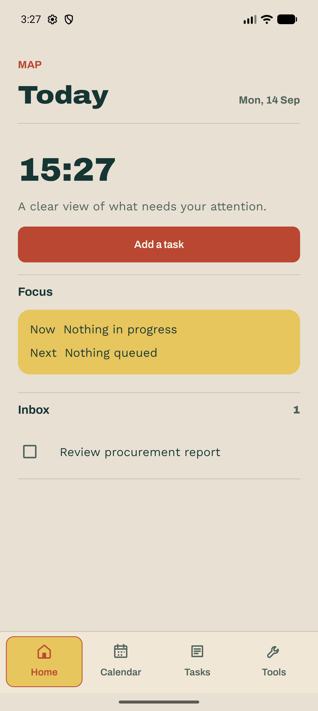
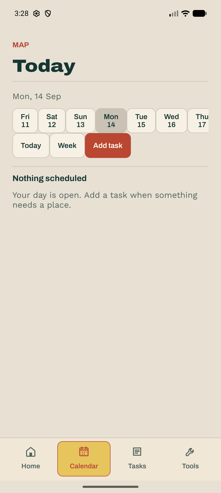
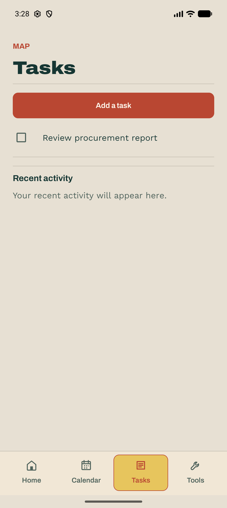
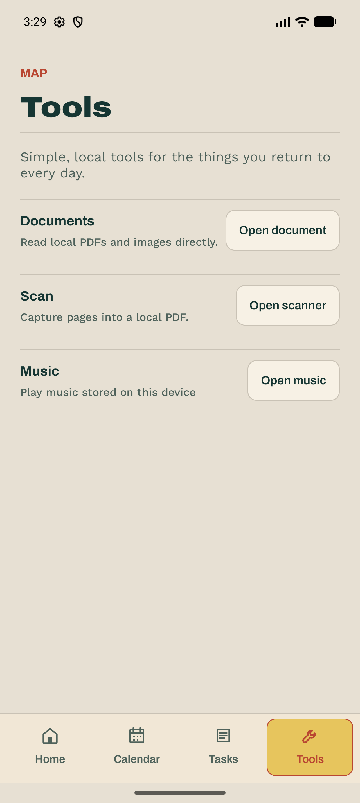
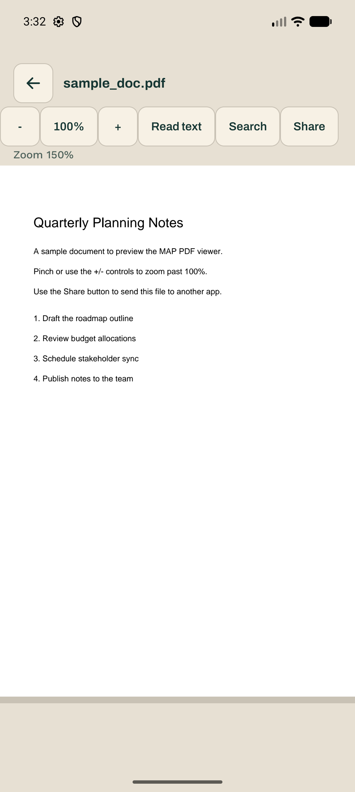
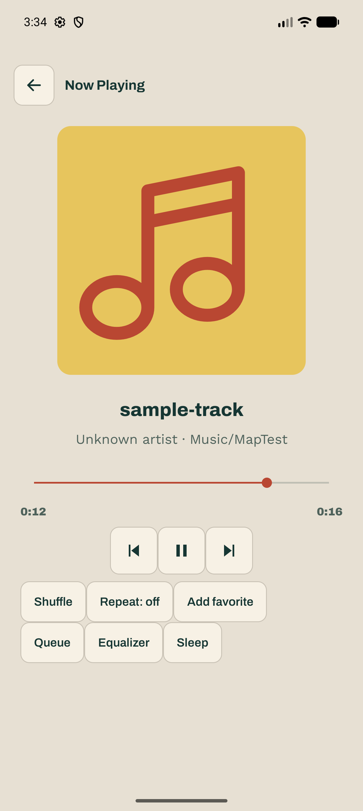

# MAP

MAP (My Awesome App) is a local-first Android daily utility app for personal use.

The MVP brings Music, Scan-to-PDF, Documents, and Tasks into one Home/Today experience. It has no account, backend, analytics, or cloud sync.

## Download

Grab the latest APK from the [Releases page](https://github.com/H4fizWasabie/map-android/releases). It's a debug-signed build, so Android will warn about installing from an unknown source — that's expected for a personal-project APK outside the Play Store.

## Screenshots

| Home | Calendar | Tasks |
| --- | --- | --- |
|  |  |  |

| Tools | Document viewer | Now Playing |
| --- | --- | --- |
|  |  |  |

## Build

Open the project in Android Studio, install Android SDK 36, and run the `app` debug variant. A shareable debug APK is produced under `app/build/outputs/apk/debug/`.

Project rules live in [AGENTS.md](AGENTS.md). Product vocabulary lives in [CONTEXT.md](CONTEXT.md). The release queue is [CHANGELOG.md](CHANGELOG.md).
